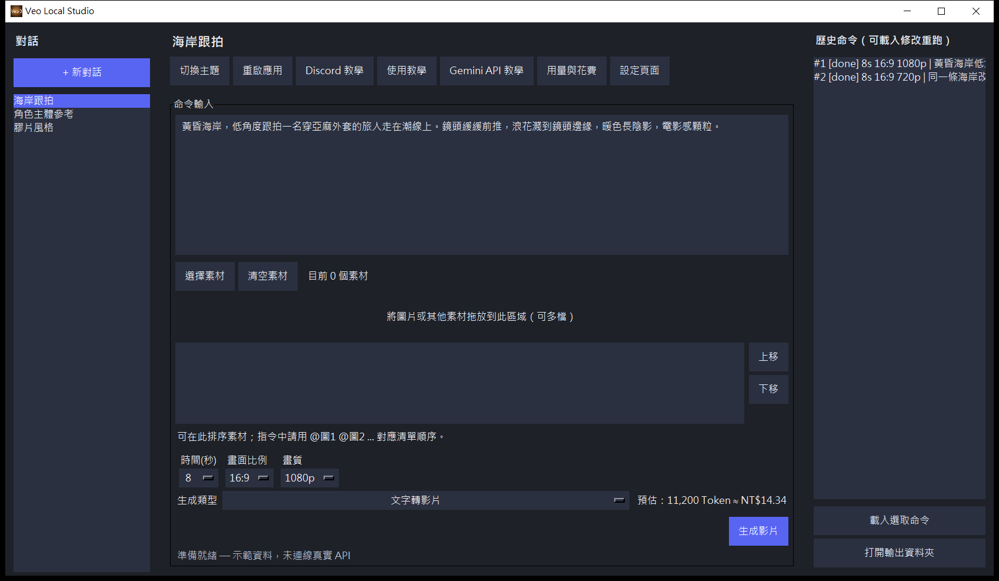
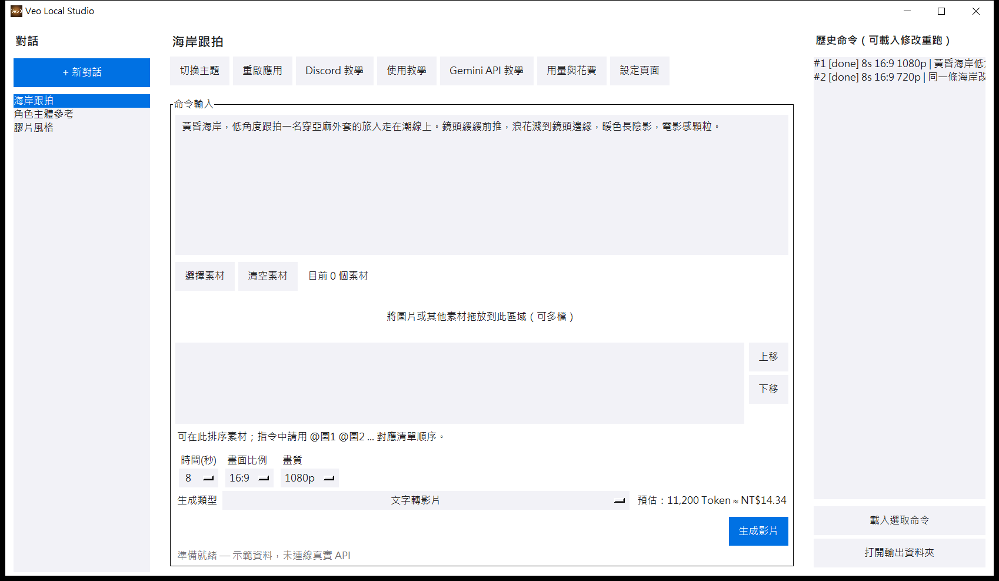
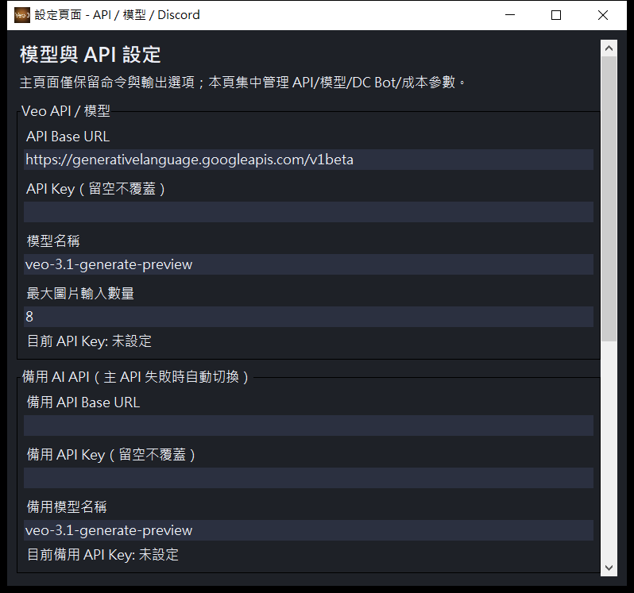
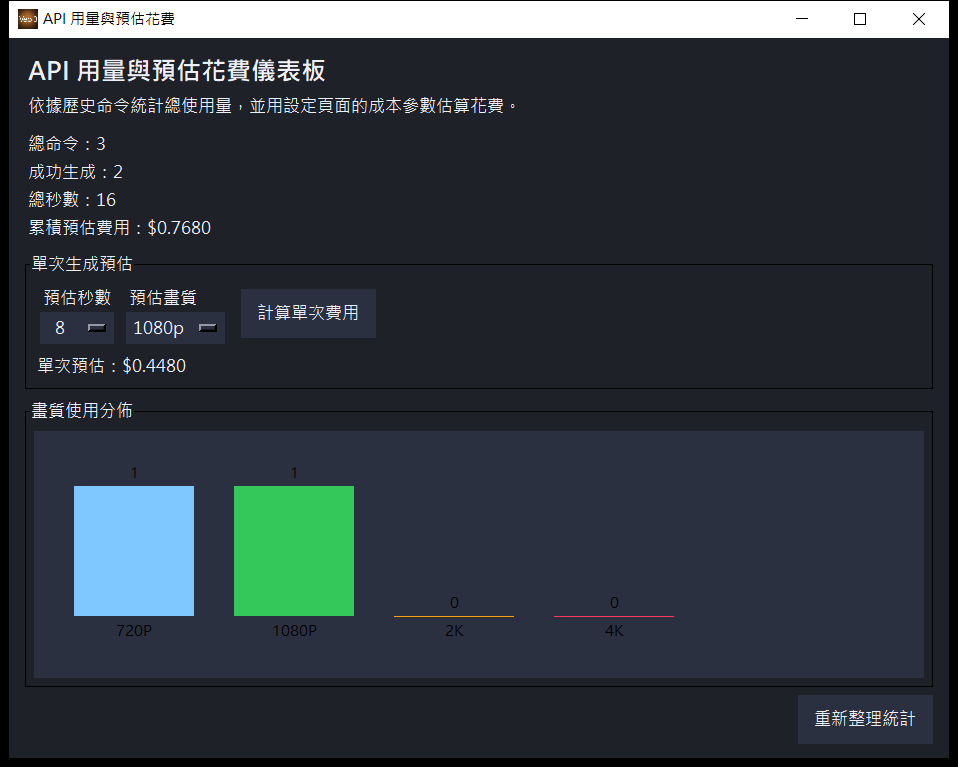
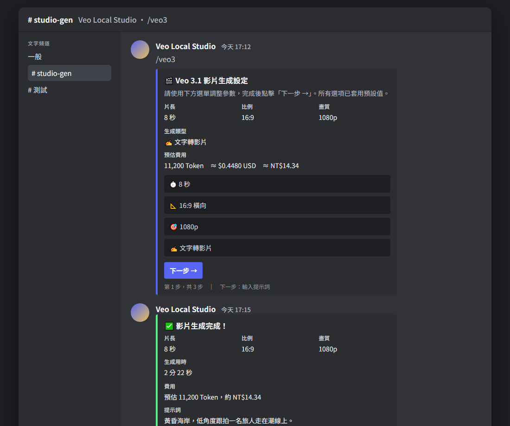
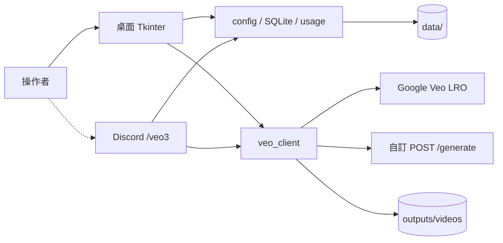

<p align="center">
  <a href="#readme"></a>
  <a href="docs/README.en.md"></a>
</p>

<p align="center">
  
</p>

<h1 align="center">Veo Local Studio</h1>

<p align="center">
  <strong>本機桌面的 Veo 3.1 影片工作室</strong><br>
  對話、素材、歷史與成本都留在這台電腦。<br>
  Discord 的 <code>/veo3</code> 是選用入口，不是產品本體。
</p>

<p align="center">
  
  
  
  
  
  
</p>

<p align="center">
  <a href="#功能">功能</a> ·
  <a href="#示範">示範</a> ·
  <a href="#架構">架構</a> ·
  <a href="#安裝">安裝</a> ·
  <a href="#專案結構">結構</a> ·
  <a href="#貢獻">貢獻</a> ·
  <a href="docs/README.md">文件索引</a> ·
  <a href="CHANGELOG.md">變更紀錄</a>
</p>

---

Veo 的生成不該散落在瀏覽器分頁、試算表與聊天室。Veo Local Studio 把提示詞、參考素材、七種生成模式與花費估算收進一個 **Windows 桌面程式**。金鑰寫在設定頁，存進本機 `data/`；影片落到 `outputs/videos`。沒有帳號系統，也沒有要對外公開的網站。

> **現況（1.0.0）。** 產品面是桌面應用。可選 Discord bot 走 `/veo3` 三步流程。舊的瀏覽器介面與 Docker 網頁進口已移除，避免兩套 UI 各說各話。金鑰請用自己的 Google AI Studio／自訂後端；本倉不提供模型、也不代收費用。

## 功能

<table>
<tr>
<td width="33%" valign="top">

### 桌面對話

左側建對話、中間寫提示詞與拖放素材、右側載入歷史再改。主題可切暗色（Discord 風）或明色（淺灰工作室）。

</td>
<td width="33%" valign="top">

### 七種生成

文字轉影片、圖轉影片、主體／風格參考、影片延伸、局部插入與移除。不合法的片長／畫質組合會在送出前被校正。

</td>
<td width="33%" valign="top">

### 可選 Discord

設定頁貼上 Bot Token 並重啟後，頻道裡用 `/veo3`：選單 → 輸入提示詞與附件 → 確認生成。同一套 `veo_client` 與用量紀錄。

</td>
</tr>
</table>

| 還有這些 | 為什麼這樣做 |
| --- | --- |
| **主 API 與備援** | 官方 Gemini 端點走 long-running operation；自訂後端則 `POST /generate`。主端失敗才換下一支。 |
| **成本看得到** | 依秒數、畫質乘數與匯率估 Token／USD／NTD。數字是估算，不是帳單。 |
| **資料不進 git** | `data/`、`outputs/`、`.env` 已忽略。金鑰只活在本機 JSON。 |
| **錯誤原文留下** | 配額用盡、內容違規、作業逾時會把 API 訊息顯示給使用者，不吞掉。 |

## 示範

桌面畫面為 2026-09-19 本機實拍（示範對話，未填真實金鑰）。Discord 為依現行 `/veo3` 字串繪製的示意，不是線上伺服器截圖。

<p align="center">
  
</p>
<p align="center"><sub>暗色主畫面。示範提示詞是黃昏海岸跟拍；右側可載入先前命令再生成。</sub></p>

<p align="center">
  
</p>
<p align="center"><sub>同一佈局的明色主題。</sub></p>

<p align="center">
  
</p>
<p align="center"><sub>設定頁集中管理模型、備援端點、Discord Token 與成本參數。金鑰欄位留空不覆蓋。</sub></p>

<p align="center">
  
</p>
<p align="center"><sub>用量與花費：總命令、成功數、秒數與畫質分布。</sub></p>

<p align="center">
  
</p>
<p align="center"><sub><code>/veo3</code> 第一步設定卡與完成卡示意。完整步驟見 <a href="docs/discord.md">docs/discord.md</a>。</sub></p>

### 一條完整路徑

```text
scripts\run_local.bat
        ↓
設定頁 → 填 API Base / Key / 模型 → 儲存
        ↓
+ 新對話 → 寫提示詞（可拖素材）→ 選片長／比例／畫質／類型
        ↓
生成影片 → outputs/videos
        ↓
右側歷史「載入選取命令」再改再跑
        ↓
（可選）啟用 Discord Bot → 重啟 → 頻道 /veo3
```

## 架構



桌面是唯一產品面。Discord bot 若啟用，會在背景執行緒登入，**呼叫同一套服務層**，不另開 HTTP 網站。

| 層 | 位置 | 可以依賴 |
| --- | --- | --- |
| 路徑 | `app/paths.py` | 環境變數 `VEO_STUDIO_DATA`、`VEO_STUDIO_OUTPUTS` |
| 設定／庫 | `app/config.py`、`app/db.py`、`app/models.py` | `paths` |
| 服務 | `app/services/` | 設定、庫、磁碟 |
| 入口 | `app/desktop.py`、`launcher.py` | 以上皆可 |
| 選用入口 | `app/services/discord_bot.py` | 服務層 |

<details>
<summary>技術細節</summary>

**Google 官方端點**　`api_base` 含 `generativelanguage.googleapis.com` 時，呼叫 `models/{model}:predictLongRunning`，輪詢 operation（最長約 8 分鐘），再從多種 response 形狀取出影片 URI。若模型拒絕 `inlineData`，會降級成純文字 prompt 再試一次。

**自訂後端**　`POST {API_BASE}/generate`，Bearer token，接受 `video_base64`、`video_url` 或 `local_saved_path`。

**生成類型**　`text_to_video`、`image_to_video`、`ref_subject`、`ref_style`、`video_extend`、`inpaint_insert`、`inpaint_remove`。Bot 端另有片長／畫質防呆：例如 `video_extend` 強制 720p，`ref_subject`／`ref_style` 固定 8 秒。

**本機資料**　`data/app_config.json`（含備份）、`data/veo_app.db`、`data/usage_log.csv` 與 `usage_log.json`。設定寫入採暫存檔再替換，避免寫到一半中斷。

**不要對公網暴露**　這是本機工具。金鑰與輸出都在工作目錄；不要把資料夾掛成公開網站。

</details>

## 安裝

需要 **Windows**、**Python 3.10+**，以及你自己的 Veo／Gemini API 金鑰。Discord 為選用。

### 1. 啟動桌面程式

```bat
scripts\run_local.bat
```

腳本會建立 `.venv`、安裝 `requirements.txt`、執行冪等的資料庫欄位升級，再開桌面視窗。

### 2. 填設定

在視窗按「設定頁面」：

- API Base URL（Google 預設為 `https://generativelanguage.googleapis.com/v1beta`）
- API Key
- 模型名稱（預設 `veo-3.1-generate-preview`）

儲存後即可在主畫面生成。備用 API 可稍後再補。

### 3. Discord（可選）

1. [Developer Portal](https://discord.com/developers/applications) 建立 Bot，打開 **Message Content Intent**。
2. 邀請時需要：Send Messages、Attach Files、Read Message History、Use Slash Commands。
3. 在設定頁勾選啟用、貼上 Token；若要指令立刻出現，填伺服器 ID（逗號分隔）。
4. 重啟應用後，在頻道輸入 `/veo3`。

細節與權限表見 [`docs/discord.md`](docs/discord.md)。打包 EXE 見 [`docs/packaging.md`](docs/packaging.md)。

## 專案結構

```text
veo-local-studio/
├── launcher.py              桌面入口
├── app/
│   ├── desktop.py           Tkinter 主視窗
│   ├── config.py            data/app_config.json
│   ├── db.py / models.py    SQLite
│   ├── paths.py             資料與輸出路徑
│   └── services/
│       ├── veo_client.py    Veo / 備援 / 成本
│       ├── discord_bot.py   /veo3
│       ├── storage.py       inputs / videos
│       └── usage_logger.py  CSV + JSON
├── assets/                  視窗圖示
├── scripts/                 啟動、遷移、擷圖、打包
├── installer/               Inno Setup
├── docs/                    英文與分冊
├── data/                    本機設定與紀錄（gitignore）
└── outputs/                 素材副本與影片（gitignore）
```

## 貢獻

歡迎修 bug、補文件、改桌面操作。請先讀 [`CONTRIBUTING.md`](CONTRIBUTING.md)。不可逆動作（push、Reset Token、會花錢的 API 呼叫）請先問。

## 授權

[MIT](LICENSE)。Veo／Gemini 與 Discord 的商標與 API 條款屬於各原廠；使用本程式產生的影片請自行遵守供應商政策。
