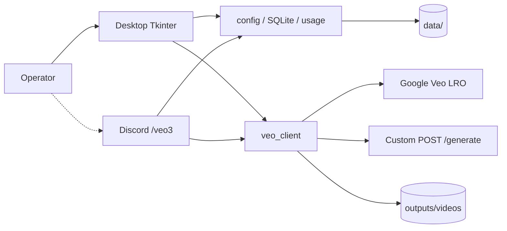

<div align="center">
  <a href="../README.md"></a>
  <a href="#readme"></a>
</div>

<div align="center">
  
</div>

<h1 align="center">Veo Local Studio</h1>

<div align="center">
  <strong>A Windows desktop studio for Veo 3.1</strong><br>
  Conversations, references, history and cost estimates stay on this machine.<br>
  Discord <code>/veo3</code> is an optional door — not the product.
</div>

<div align="center">
  
  
  
  
  
  
</div>

<div align="center">
  <a href="#features">Features</a> ·
  <a href="#demo">Demo</a> ·
  <a href="#architecture">Architecture</a> ·
  <a href="#installation">Installation</a> ·
  <a href="#project-structure">Structure</a> ·
  <a href="#contributing">Contributing</a> ·
  <a href="./README.md">Docs index</a> ·
  <a href="../CHANGELOG.md">Changelog</a>
</div>

---

Veo jobs should not live across browser tabs, spreadsheets and chat threads. Veo Local Studio keeps the prompt, reference media, seven generation modes and a running cost estimate in one **Windows desktop app**. Keys are typed in Settings and stored under local `data/`; finished films land in `outputs/videos`. There is no account system and no public website.

> **Status (1.0.0).** The product surface is the desktop app. An optional Discord bot exposes `/veo3` as a three-step flow. The old browser UI and Docker web entry were removed so the two faces could not drift apart. You bring your own Google AI Studio (or custom) key. This repository does not host a model and does not bill on your behalf.

English in this project is **English**. The desktop and Discord strings are Traditional Chinese.

## Features

<table>
<tr>
<td width="33%" valign="top">

### Desktop conversations

Create a thread on the left, write the prompt and drop assets in the centre, reload history on the right. Theme: dark (Discord-like) or light (pale studio grey).

</td>
<td width="33%" valign="top">

### Seven generation types

Text-to-video, image-to-video, subject / style references, video extend, inpaint insert and remove. Illegal duration / quality pairings are corrected before the request leaves the machine.

</td>
<td width="33%" valign="top">

### Optional Discord

Paste a bot token in Settings, restart, then run `/veo3` in a channel: menus → prompt and attachments → confirm. The same `veo_client` and usage log.

</td>
</tr>
</table>

| Also | Why |
| --- | --- |
| **Primary and fallback APIs** | Official Gemini bases use the long-running operation. A custom backend is `POST /generate`. The next provider is tried only after the current one fails. |
| **Costs stay visible** | Token / USD / TWD figures are estimates from seconds, quality multipliers and an exchange rate — not an invoice. |
| **Nothing secret is committed** | `data/`, `outputs/` and `.env` are ignored. Keys live only in a local JSON file. |
| **Vendor errors are shown** | Quota, safety and timeout messages reach the operator. They are not swallowed. |

## Demo

Desktop frames were captured on this machine on 2026-09-19 with demonstration conversations and no real keys. The Discord image is drawn from the current `/veo3` copy; it is not a live-server screenshot.

<div align="center">
  
</div>
<div align="center"><sub>Dark main window. The sample prompt is a dusk shoreline follow-shot; the right-hand list reloads earlier commands.</sub></div>

<div align="center">
  
</div>
<div align="center"><sub>The same layout in the light theme.</sub></div>

<div align="center">
  
</div>
<div align="center"><sub>Settings holds the model, fallback endpoint, Discord token and cost model. Leaving a key blank keeps the stored value.</sub></div>

<div align="center">
  
</div>
<div align="center"><sub>Usage and spend: command counts, seconds and quality mix.</sub></div>

<div align="center">
  
</div>
<div align="center"><sub>Illustrated <code>/veo3</code> settings and completion cards. The full walk-through is in <a href="./discord.md">discord.md</a>.</sub></div>

### One complete path

```text
scripts\run_local.bat
        ↓
Settings → API base / key / model → Save
        ↓
+ New conversation → prompt (assets optional) → duration / ratio / quality / type
        ↓
Generate → outputs/videos
        ↓
Load a history row, edit, run again
        ↓
(optional) Enable Discord → restart → /veo3 in a channel
```

## Architecture



The desktop is the only product face. If the bot is enabled it logs in on a background thread and **calls the same services**. There is no HTTP site.

| Layer | Path | May depend on |
| --- | --- | --- |
| Paths | `app/paths.py` | `VEO_STUDIO_DATA`, `VEO_STUDIO_OUTPUTS` |
| Config / store | `app/config.py`, `app/db.py`, `app/models.py` | `paths` |
| Services | `app/services/` | config, store, disk |
| Entry | `app/desktop.py`, `launcher.py` | any of the above |
| Optional entry | `app/services/discord_bot.py` | services |

<details>
<summary>Technical notes</summary>

**Official Google base**　When `api_base` contains `generativelanguage.googleapis.com`, the client calls `models/{model}:predictLongRunning`, polls the operation (about eight minutes at most), then reads a video URI from several response shapes. If the model rejects `inlineData`, it retries with a text-only prompt.

**Custom backend**　`POST {API_BASE}/generate` with a bearer token. Accepted payloads: `video_base64`, `video_url`, or `local_saved_path`.

**Generation types**　`text_to_video`, `image_to_video`, `ref_subject`, `ref_style`, `video_extend`, `inpaint_insert`, `inpaint_remove`. The bot also clamps pairings: `video_extend` is forced to 720p; subject / style references stay at 8 seconds.

**Local files**　`data/app_config.json` (plus a backup), `data/veo_app.db`, `data/usage_log.csv` and `usage_log.json`. Config writes go to a temporary file first so a crash cannot leave a half-written key file.

**Do not publish the folder**　This is a local tool. Keys and renders live next to the working tree. Do not mount it as a public website.

</details>

## Installation

You need **Windows**, **Python 3.10+**, and your own Veo / Gemini API key. Discord is optional.

### 1. Start the desktop app

```bat
scripts\run_local.bat
```

The script creates `.venv`, installs `requirements.txt`, runs an idempotent column upgrade, then opens the window.

### 2. Fill in Settings

Open **Settings**:

- API Base URL (Google default: `https://generativelanguage.googleapis.com/v1beta`)
- API key
- Model name (default `veo-3.1-generate-preview`)

Save, then generate from the main window. A fallback API can wait.

### 3. Discord (optional)

1. Create a bot in the [Developer Portal](https://discord.com/developers/applications) and turn on **Message Content Intent**.
2. Invite with Send Messages, Attach Files, Read Message History, and Use Slash Commands.
3. Enable the bot in Settings and paste the token. For instant command visibility, add guild IDs (comma-separated).
4. Restart the app, then type `/veo3` in a channel.

Walk-through and permissions: [`discord.md`](discord.md). Building an installer: [`packaging.md`](packaging.md).

## Project structure

```text
veo-local-studio/
├── launcher.py              desktop entry
├── app/
│   ├── desktop.py           Tkinter window
│   ├── config.py            data/app_config.json
│   ├── db.py / models.py    SQLite
│   ├── paths.py             data and output roots
│   └── services/
│       ├── veo_client.py    Veo / fallback / cost
│       ├── discord_bot.py   /veo3
│       ├── storage.py       inputs / videos
│       └── usage_logger.py  CSV + JSON
├── assets/                  window icon
├── scripts/                 launch, migrate, shots, pack
├── installer/               Inno Setup
├── docs/                    English and extra guides
├── data/                    local settings (gitignored)
└── outputs/                 copies and films (gitignored)
```

## Contributing

Bug fixes, documentation and desktop UX are welcome. Read [`CONTRIBUTING.md`](../CONTRIBUTING.md) first. Ask before anything irreversible (push, token reset, a paid API call).

## Licence

[MIT](../LICENSE). Veo / Gemini and Discord marks and API terms belong to their vendors. Films you generate remain your responsibility under those terms.
